# Mermaid Dark Theme Configuration

This document standardizes the dark theme styling used across all Mermaid diagrams in the Premium Customer Notification System architecture.

## Active Theme Configuration

All diagrams use this **dark theme with high-contrast colors** optimized for presentations and whiteboards.

### Theme Init Block (Required for all diagrams)

Add this initialization block to the beginning of every Mermaid diagram:

```text
%%{init: {'theme':'dark', 'themeVariables': {'primaryColor':'#2E5C8A', 'primaryTextColor':'#fff', 'primaryBorderColor':'#1a3a52', 'lineColor':'#4A90E2', 'secondBkgColor':'#1e1e1e', 'fontSize':'14px', 'fontFamily':'Arial'}, 'flowchart': {'htmlLabels': true}}}%%
```

## Color Palette

The following color scheme is applied consistently across all diagram elements:

| Component Type | Color | Hex Code | Stroke | Use Case |
|---|---|---|---|---|
| Triggers / Events / Users | Red | `#E74C3C` | `#C0392B` | Scheduled events, user interactions, load balancers |
| Microservices / Processors | Blue | `#3498DB` | `#1f618d` | Services, API endpoints, business logic |
| Databases / Storage | Green | `#27AE60` | `#145a32` | PostgreSQL, caches, data stores |
| Message Queues / Events | Purple | `#8E44AD` | `#4a235a` | RabbitMQ, event streaming, async communication |
| External Systems / APIs | Orange | `#F39C12` | `#D68910` | Banking APIs, SMS providers, third-party services |
| Monitoring / Observability | Dark Gray | `#2C3E50` | `#1A252F` | Prometheus, ELK Stack, logging |
| Subgraph Backgrounds | Dark | `#2e2e2e` | `#555` | Container/layer groupings |

## Node Styling Template

Apply consistent styling to all nodes using this template:

```text
style NodeId fill:#colorHex,stroke:#strokeHex,stroke-width:2px,color:#fff
```

### Complete Style Examples

**Service Node:**

```mermaid
style BalanceService fill:#3498DB,stroke:#1f618d,stroke-width:2px,color:#fff
```

**Database Node:**

```mermaid
style PostgreSQL fill:#27AE60,stroke:#145a32,stroke-width:2px,color:#fff
```

**Event/Trigger Node:**

```mermaid
style BalanceCheck fill:#E74C3C,stroke:#C0392B,stroke-width:2px,color:#fff
```

**Message Queue Node:**

```mermaid
style MessageQueue fill:#8E44AD,stroke:#4a235a,stroke-width:2px,color:#fff
```

**External System Node:**

```mermaid
style BankingAPI fill:#F39C12,stroke:#D68910,stroke-width:2px,color:#fff
```

**Monitoring Node:**

```mermaid
style Prometheus fill:#2C3E50,stroke:#1A252F,stroke-width:2px,color:#fff
```

**Subgraph Container:**

```mermaid
style ServiceLayer fill:#2e2e2e,stroke:#555,stroke-width:2px
```

## Theme Characteristics

✅ **Benefits:**

- Professional dark background for presentations
- High contrast white text on dark colors
- Eye-friendly for extended viewing
- Whiteboard-friendly with vibrant colors
- Consistent semantic color coding across all diagrams
- 2px stroke width for improved visibility

## Implementation Rules

### Rule 1: Always Include Theme Init

Every Mermaid diagram block MUST start with the theme initialization:

```text
%%{init: {'theme':'dark', 'themeVariables': {'primaryColor':'#2E5C8A', 'primaryTextColor':'#fff', 'primaryBorderColor':'#1a3a52', 'lineColor':'#4A90E2', 'secondBkgColor':'#1e1e1e', 'fontSize':'14px', 'fontFamily':'Arial'}, 'flowchart': {'htmlLabels': true}}}%%
```

### Rule 2: Use Semantic Colors

Color nodes based on their function, not appearance:

- **Red** = Events that trigger processes
- **Blue** = Services that process data
- **Green** = Data storage and caches
- **Purple** = Asynchronous communication
- **Orange** = External integrations
- **Dark Gray** = Operations and monitoring

### Rule 3: Consistent Stroke Width

Always use `stroke-width:2px` for all nodes:

```text
style NodeId fill:#colorHex,stroke:#strokeHex,stroke-width:2px,color:#fff
```

### Rule 4: White Text

Always use white text (`color:#fff`) for readability on dark backgrounds:

```text
style NodeId fill:#colorHex,stroke:#strokeHex,stroke-width:2px,color:#fff
```

### Rule 5: Dark Subgraph Backgrounds

For swimlane/layer groupings, use dark background:

```text
style LayerName fill:#2e2e2e,stroke:#555,stroke-width:2px
```

## File Organization

All Mermaid diagrams should be placed in `/docs/architecture/diagrams/`:

```
/docs/architecture/diagrams/
├── data-flow.md              # Data flow diagrams (3 flows)
├── deployment.md             # Deployment topology
├── c4-context.md             # System context diagram
├── c4-container.md           # Container architecture diagram
└── README.md                 # Diagram index
```

## Complete Example: Data Flow Diagram

```mermaid
%%{init: {'theme':'dark', 'themeVariables': {'primaryColor':'#2E5C8A', 'primaryTextColor':'#fff', 'primaryBorderColor':'#1a3a52', 'lineColor':'#4A90E2', 'secondBkgColor':'#1e1e1e', 'fontSize':'14px', 'fontFamily':'Arial'}, 'flowchart': {'htmlLabels': true}}}%%
graph TD
    A["⏰ Daily Balance Check 22:00 PM"]
    B["⚙️ Balance Monitoring Service"]
    C[("📊 PostgreSQL Customer Table")]
    D["🔌 Call Banking API"]
    E["🏦 Core Banking System"]
    
    A -->|Triggered| B
    B -->|Query all customers| C
    B -->|For each batch| D
    D -->|Get balance data| E
    E -->|Return balance data| D
    D -->|Map and validate| B
    
    style A fill:#E74C3C,stroke:#C0392B,stroke-width:2px,color:#fff
    style B fill:#3498DB,stroke:#1f618d,stroke-width:2px,color:#fff
    style C fill:#27AE60,stroke:#145a32,stroke-width:2px,color:#fff
    style D fill:#F39C12,stroke:#D68910,stroke-width:2px,color:#fff
    style E fill:#F39C12,stroke:#D68910,stroke-width:2px,color:#fff
```



## Quick Reference: Color Hex Codes

Copy and paste ready color codes:

```text
Triggers/Events:     #E74C3C (fill), #C0392B (stroke)
Services:            #3498DB (fill), #1f618d (stroke)
Databases:           #27AE60 (fill), #145a32 (stroke)
Queues:              #8E44AD (fill), #4a235a (stroke)
External:            #F39C12 (fill), #D68910 (stroke)
Monitoring:          #2C3E50 (fill), #1A252F (stroke)
Subgraph:            #2e2e2e (fill), #555 (stroke)
```

## Verification Checklist

Before committing any diagram:

- [ ] Theme init block present at start of diagram
- [ ] All nodes have appropriate semantic color (based on function)
- [ ] All styles use `stroke-width:2px`
- [ ] All text color is `#fff` for dark backgrounds
- [ ] Subgraphs use `#2e2e2e` fill with `#555` stroke
- [ ] No special characters in node labels (follow mermaid.instructions.md rules)
- [ ] Diagram renders without parser errors
- [ ] Colors are visually distinct and readable on dark background

## VS Code Settings

Optional: Add to `.vscode/settings.json` for consistency:

```json
{
  "markdown.mermaid.theme": "dark",
  "markdown.mermaid.themeVariables": {
    "primaryColor": "#2E5C8A",
    "primaryTextColor": "#fff",
    "primaryBorderColor": "#1a3a52",
    "lineColor": "#4A90E2",
    "secondBkgColor": "#1e1e1e",
    "fontSize": "14px"
  }
}
```

## References

- [Mermaid Theme Documentation](https://mermaid.js.org/syntax/theming.html)
- [Mermaid Configuration Guide](https://mermaid.js.org/config/configuration.html)
- [Color Accessibility](https://contrast-ratio.com/) - Verify color contrast ratios

## Changelog

| Version | Date | Changes |
|---------|------|---------|
| 1.0 | 2025-11-19 | Initial dark theme configuration with semantic color palette |
