# Mermaid Diagrams Instructions

## Overview

Mermaid is a JavaScript-based diagramming and charting tool that uses a simple, markdown-inspired syntax to create diagrams dynamically. This guide covers best practices for building diagrams for the Premium Customer Notification System architecture.

All diagrams in this project use a **standardized dark theme** for consistency. See `mermaid-theme.md` for complete theme configuration and color palette details.

## Critical Rules for Mermaid Syntax

### 1. **No Wrapper Markers**
- ❌ **WRONG**: Start file with `````markdown` or ````markdown`
- ✅ **CORRECT**: Start directly with content or markdown heading

### 2. **Node Label Restrictions**
Avoid special characters and symbols that break the parser:
- ❌ AVOID: Curly braces in labels `{"text"}` 
- ❌ AVOID: Forward slashes with parameters `/accounts/{id}/balance`
- ❌ AVOID: Greater than/less than symbols `>= 15000` or `<br/>`
- ❌ AVOID: Question marks and ampersands in labels
- ✅ USE: Plain text or emojis with proper spacing
- ✅ USE: Line breaks with `<br>` (not `<br/>`)
- ✅ USE: Spelled out operators like "ge" (greater or equal) instead of ">="

### 3. **Code Block Syntax**
```markdown
\```mermaid
graph TD
  // diagram content
\```
```
- Use exactly three backticks (not four or more)
- Include `mermaid` language identifier
- Close with three backticks

### 4. **Theme Initialization (REQUIRED)**

**Every Mermaid diagram MUST include this theme initialization at the start:**

```text
%%{init: {'theme':'dark', 'themeVariables': {'primaryColor':'#2E5C8A', 'primaryTextColor':'#fff', 'primaryBorderColor':'#1a3a52', 'lineColor':'#4A90E2', 'secondBkgColor':'#1e1e1e', 'fontSize':'14px', 'fontFamily':'Arial'}, 'flowchart': {'htmlLabels': true}}}%%
```

This ensures all diagrams use the standardized dark theme configured in `mermaid-theme.md`.

### 5. **Node Declaration Syntax**

| Type | Syntax | Example |
|------|--------|---------|
| Rectangle | `A["text"]` | `A["Service Name"]` |
| Rounded | `A("text")` | `A("Process")` |
| Database/Cylinder | `A[("text")]` | `A[("PostgreSQL DB")]` |
| Diamond Decision | `A{text}` | `A{Phone valid}` |
| Circle | `A((text))` | `A((Node))` |
| Subroutine | `A[[text]]` | `A[[Function]]` |

### 5. **Arrow/Connection Syntax**

| Type | Syntax | Example |
|------|--------|---------|
| Arrow | `A -->|label| B` | `A -->|Triggered| B` |
| Dashed | `A -.->|label| B` | `A -.->|Async| B` |
| Thick | `A ==>|label| B` | `A ==>|Process| B` |
| No label | `A --> B` | Direct connection |

### 6. **Styling**

All nodes must use the semantic color scheme from `mermaid-theme.md`:

```text
style NodeId fill:#colorHex,stroke:#strokeHex,stroke-width:2px,color:#fff
```

**Color Reference:**
- **Red (#E74C3C)** - Triggers, events, users, load balancers
- **Blue (#3498DB)** - Microservices, processors
- **Green (#27AE60)** - Databases, data storage, caches
- **Purple (#8E44AD)** - Message queues, event streaming
- **Orange (#F39C12)** - External systems, APIs
- **Dark Gray (#2C3E50)** - Monitoring, logging, observability
- **Dark (#2e2e2e)** - Subgraph/layer backgrounds

See `mermaid-theme.md` for complete color palette and implementation rules.

## Fixed Issues in Current Diagrams

### Previous Problems & Solutions

#### Problem 1: Node Label with Symbols
```mermaid
// ❌ BROKE PARSER:
J{"✓ All days >= 15000 NIS?"}

// ✅ FIXED:
J{All days ge 15000 NIS}
```

#### Problem 2: Edge Label with Path Parameters
```mermaid
// ❌ BROKE PARSER:
D -->|GET /accounts/{id}/balance| E

// ✅ FIXED:
D -->|GET balance info| E
```

#### Problem 3: File Wrapping
```markdown
// ❌ BROKE PARSER:
\`\`\`\`markdown
# Data Flow Diagrams
...
\`\`\`

// ✅ FIXED:
# Data Flow Diagrams
...
```

#### Problem 4: HTML Line Breaks
```mermaid
// ❌ BROKE PARSER:
A["Text<br/>on lines"]

// ✅ FIXED:
A["Text<br>on lines"]
```

#### Problem 5: Multiple Line Breaks in Decision Nodes
```mermaid
// ❌ COMPLICATED:
J{All days greater than or<br/>equal to 15000 NIS?}

// ✅ SIMPLIFIED:
J{All days ge 15000 NIS}
```

## Step-by-Step Guide: Creating a Diagram

### Step 1: Add Theme Initialization
Start every diagram with the theme init block:
```text
%%{init: {'theme':'dark', 'themeVariables': {'primaryColor':'#2E5C8A', 'primaryTextColor':'#fff', 'primaryBorderColor':'#1a3a52', 'lineColor':'#4A90E2', 'secondBkgColor':'#1e1e1e', 'fontSize':'14px', 'fontFamily':'Arial'}, 'flowchart': {'htmlLabels': true}}}%%
```

### Step 2: Define Graph Type
```mermaid
graph TD  // Top-Down (most common)
// OR
graph LR  // Left-Right
// OR
graph TB  // Top-Bottom (same as TD)
```

### Step 3: Declare Nodes
```mermaid
A["Start Point"]
B["Process"]
C{Decision}
D[("Database")]
```

### Step 4: Define Connections
```mermaid
A -->|Action| B
B -->|Yes| C
B -->|No| D
```

### Step 5: Apply Semantic Styling
Use color coding from `mermaid-theme.md`:
```text
style A fill:#E74C3C,stroke:#C0392B,stroke-width:2px,color:#fff
style B fill:#3498DB,stroke:#1f618d,stroke-width:2px,color:#fff
style D fill:#27AE60,stroke:#145a32,stroke-width:2px,color:#fff
```

## Complete Example: Balance Verification Flow

```mermaid
%%{init: {'theme':'dark', 'themeVariables': {'primaryColor':'#2E5C8A', 'primaryTextColor':'#fff', 'primaryBorderColor':'#1a3a52', 'lineColor':'#4A90E2', 'secondBkgColor':'#1e1e1e', 'fontSize':'14px', 'fontFamily':'Arial'}, 'flowchart': {'htmlLabels': true}}}%%
graph TD
    A["⏰ Daily Balance Check 22:00 PM"]
    B["⚙️ Balance Monitoring Service"]
    C[("📊 PostgreSQL Customer Table")]
    D["🔌 Call Banking API"]
    E["🏦 Core Banking System"]
    
    A -->|Triggered| B
    B -->|Query all customers| C
    B -->|For each batch| D
    D -->|Get balance data| E
    E -->|Return balance data| D
    D -->|Map and validate| B
    
    style A fill:#E74C3C,stroke:#C0392B,stroke-width:2px,color:#fff
    style B fill:#3498DB,stroke:#1f618d,stroke-width:2px,color:#fff
    style C fill:#27AE60,stroke:#145a32,stroke-width:2px,color:#fff
    style D fill:#F39C12,stroke:#D68910,stroke-width:2px,color:#fff
    style E fill:#F39C12,stroke:#D68910,stroke-width:2px,color:#fff
```



## Best Practices

### 1. **Simplify Labels**
- Keep node labels under 40 characters
- Use abbreviations and clear terms
- Avoid punctuation and special characters

### 2. **Use Emojis Wisely**
- Emojis are safe and improve readability
- Use at start of labels: `⏰ Timer`, `📊 Data`, `⚙️ Service`
- Don't mix with special characters

### 3. **Use Semantic Color Coding**
Refer to `mermaid-theme.md` for color meanings:
- Red (#E74C3C) - Triggers, events, users
- Blue (#3498DB) - Services and processors
- Green (#27AE60) - Databases and storage
- Purple (#8E44AD) - Message queues and events
- Orange (#F39C12) - External systems and APIs
- Dark Gray (#2C3E50) - Monitoring and observability

### 4. **Keep Graphs Simple**
- Max 15-20 nodes per diagram
- Use multiple diagrams for complex systems
- Group related flows together

### 5. **Label Connections Clearly**
- Describe what data flows
- Use action verbs: "Query", "Submit", "Publish", "Poll"
- Keep labels under 30 characters

### 6. **Test Edge Cases**
Before finalizing, ensure:
- No curly braces in node text
- No forward slashes with parameters
- No `>` or `<` symbols in comparisons
- All `<br>` tags closed (not `<br/>`)
- Three backticks only (not four)
- Balanced node declarations
- Theme initialization present

## Common Parser Errors & Fixes

| Error | Cause | Fix |
|-------|-------|-----|
| "No diagram type detected" | Wrapper markers or empty block | Remove `````markdown` |
| "Expecting node type" | Special chars in labels | Use plain text or emojis |
| "Parse error on line X" | Curly braces or slashes | Remove `{}` and `/` |
| "Unexpected token" | HTML tags | Use `<br>` not `<br/>` |
| "Invalid edge label" | Symbols in edge text | Simplify to plain text |

## File Organization

```
/docs/architecture/
├── .github/instructions/
│   ├── mermaid.instructions.md    (This file - syntax rules)
│   └── mermaid-theme.md           (Theme config & color palette)
└── diagrams/
    ├── data-flow.md               (Data flow diagrams - 3 flows)
    ├── deployment.md              (Deployment topology)
    ├── c4-context.md              (System context diagram)
    ├── c4-container.md            (Container architecture)
    └── README.md                  (Diagram index)
```

**Note**: Use `.md` extension for all Mermaid diagrams

## Verification Checklist

- [ ] File starts with markdown heading or content (no wrapper markers)
- [ ] All code blocks use exactly 3 backticks
- [ ] All node labels have no curly braces, slashes, or comparison symbols
- [ ] All `<br>` tags are closed properly (not `<br/>`)
- [ ] Decision nodes use simplified text (e.g., "ge" instead of ">=")
- [ ] Colors use valid hex codes
- [ ] No empty diagram blocks
- [ ] Diagram renders without parser errors

## References

- [Mermaid Official Docs](https://mermaid.live)
- [Mermaid Graph Syntax](https://mermaid.js.org/syntax/graph.html)
- [Mermaid Styling Guide](https://mermaid.js.org/syntax/styling.html)
