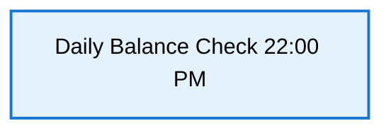

# Mermaid Theme Configuration

Create a `.mermaid.json` or add to your HTML/markdown with theme settings.

## Option 1: Global Theme Configuration

Add this to your project's root or documentation build process:

```json
{
  "theme": "default",
  "themeVariables": {
    "primaryColor": "#4A90E2",
    "primaryBorderColor": "#2E5C8A",
    "lineColor": "#5D6B7A",
    "secondBkgColor": "#F0F4F8",
    "tertiaryColor": "#FFFFFF",
    "tertiaryBorderColor": "#2E5C8A",
    "textColor": "#1F2937",
    "fontFamily": "Arial, sans-serif",
    "fontSize": "14px",
    "fontFace": "Arial"
  }
}
```

## Option 2: Inline Mermaid Configuration (Add to each diagram)

### For Data Flow Diagrams



## Option 3: Custom Stylesheet (Recommended for Whiteboard)

```css
/* mermaid-theme.css */

:root {
  /* Primary Brand Colors */
  --primary-blue: #4A90E2;
  --primary-dark: #2E5C8A;
  --secondary-blue: #6CB4E6;
  
  /* Service Colors */
  --service-color: #4A90E2;
  --service-text: #FFFFFF;
  --service-border: #2E5C8A;
  
  /* Database Colors */
  --database-color: #50C878;
  --database-text: #FFFFFF;
  --database-border: #2D7A4F;
  
  /* Queue/Message Colors */
  --queue-color: #9B59B6;
  --queue-text: #FFFFFF;
  --queue-border: #5E2E7A;
  
  /* External System Colors */
  --external-color: #F39C12;
  --external-text: #FFFFFF;
  --external-border: #D68910;
  
  /* Trigger/Event Colors */
  --trigger-color: #E74C3C;
  --trigger-text: #FFFFFF;
  --trigger-border: #C0392B;
  
  /* Background */
  --background: #FFFFFF;
  --text-color: #2C3E50;
  --border-color: #BDC3C7;
}
```

## Option 4: Modern Whiteboard-Friendly Theme

Add this to your Mermaid diagrams:


## Color Palette for Your Diagrams

| Component | Background | Text | Border | Hex |
|-----------|-----------|------|--------|-----|
| Services | Sky Blue | White | Dark Blue | `#4A90E2` / `#FFFFFF` / `#2E5C8A` |
| Databases | Emerald Green | White | Dark Green | `#50C878` / `#FFFFFF` / `#2D7A4F` |
| Message Queues | Purple | White | Dark Purple | `#9B59B6` / `#FFFFFF` / `#5E2E7A` |
| External Systems | Golden Orange | White | Dark Orange | `#F39C12` / `#FFFFFF` / `#D68910` |
| Triggers/Events | Coral Red | White | Dark Red | `#E74C3C` / `#FFFFFF` / `#C0392B` |

## Implementation for Your Diagrams

Update your `data-flow.md`:


## VS Code Configuration

Add to `.vscode/settings.json`:

```json
{
  "markdown.mermaid.theme": "base",
  "markdown.mermaid.themeVariables": {
    "primaryColor": "#4A90E2",
    "primaryTextColor": "#FFFFFF",
    "primaryBorderColor": "#2E5C8A",
    "lineColor": "#5D6B7A",
    "fontSize": "16px"
  }
}
```

## Best Practices for Whiteboard Display

1. **High Contrast**: Use bright colors on white background
2. **Large Fonts**: Minimum 14px, preferably 16px
3. **Thick Strokes**: Use `stroke-width:2px` or higher
4. **Readable Emojis**: Remove if hard to see (optional)
5. **Color Blind Safe**: Avoid pure red/green pairs

## Quick Reference Colors

- **Services**: `#4A90E2` (Bright Blue)
- **Databases**: `#50C878` (Emerald Green)
- **Queues**: `#9B59B6` (Royal Purple)
- **External**: `#F39C12` (Golden Orange)
- **Triggers**: `#E74C3C` (Coral Red)
- **Text**: `#FFFFFF` (White text) or `#2C3E50` (Dark text)
