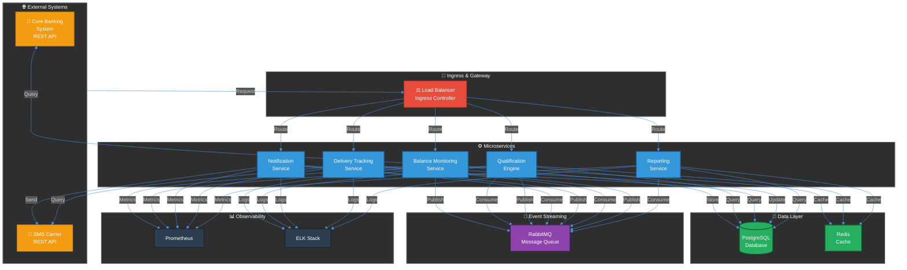

# C4 Container Diagram

```mermaid
%%{init: {'theme':'dark', 'themeVariables': {'primaryColor':'#2E5C8A', 'primaryTextColor':'#fff', 'primaryBorderColor':'#1a3a52', 'lineColor':'#4A90E2', 'secondBkgColor':'#1e1e1e', 'fontSize':'14px', 'fontFamily':'Arial'}, 'flowchart': {'htmlLabels': true}}}%%
graph TB
    subgraph External["🌐 External Systems"]
        BankingAPI["🏦 Core Banking<br/>System<br/>REST API"]
        SMSCarrier["📲 SMS Carrier<br/>REST API"]
    end
    
    subgraph Ingress["🚪 Ingress & Gateway"]
        LB["⚖️ Load Balancer<br/>Ingress Controller"]
    end
    
    subgraph Services["⚙️ Microservices"]
        BalanceSvc["Balance Monitoring<br/>Service"]
        QualificationSvc["Qualification<br/>Engine"]
        NotificationSvc["Notification<br/>Service"]
        TrackingSvc["Delivery Tracking<br/>Service"]
        ReportingSvc["Reporting<br/>Service"]
    end
    
    subgraph Data["💾 Data Layer"]
        PostgreSQL[("PostgreSQL<br/>Database")]
        Redis["Redis<br/>Cache"]
    end
    
    subgraph Messaging["📨 Event Streaming"]
        MessageQueue["RabbitMQ<br/>Message Queue"]
    end
    
    subgraph Monitoring["📊 Observability"]
        Prometheus["Prometheus"]
        Logs["ELK Stack"]
    end
    
    External -->|Request| LB
    LB -->|Route| BalanceSvc
    LB -->|Route| QualificationSvc
    LB -->|Route| NotificationSvc
    LB -->|Route| TrackingSvc
    LB -->|Route| ReportingSvc
    
    BalanceSvc -->|Query| BankingAPI
    BalanceSvc -->|Store| PostgreSQL
    BalanceSvc -->|Publish| MessageQueue
    BalanceSvc -->|Cache| Redis
    
    QualificationSvc -->|Query| PostgreSQL
    QualificationSvc -->|Consume| MessageQueue
    QualificationSvc -->|Publish| MessageQueue
    QualificationSvc -->|Cache| Redis
    
    NotificationSvc -->|Query| PostgreSQL
    NotificationSvc -->|Consume| MessageQueue
    NotificationSvc -->|Send| SMSCarrier
    NotificationSvc -->|Publish| MessageQueue
    
    TrackingSvc -->|Query| SMSCarrier
    TrackingSvc -->|Update| PostgreSQL
    TrackingSvc -->|Consume| MessageQueue
    TrackingSvc -->|Publish| MessageQueue
    
    ReportingSvc -->|Consume| MessageQueue
    ReportingSvc -->|Query| PostgreSQL
    ReportingSvc -->|Cache| Redis
    
    BalanceSvc -->|Metrics| Prometheus
    QualificationSvc -->|Metrics| Prometheus
    NotificationSvc -->|Metrics| Prometheus
    TrackingSvc -->|Metrics| Prometheus
    ReportingSvc -->|Metrics| Prometheus
    
    BalanceSvc -->|Logs| Logs
    QualificationSvc -->|Logs| Logs
    NotificationSvc -->|Logs| Logs
    TrackingSvc -->|Logs| Logs
    ReportingSvc -->|Logs| Logs
    
    style BankingAPI fill:#F39C12,stroke:#D68910,stroke-width:2px,color:#fff
    style SMSCarrier fill:#F39C12,stroke:#D68910,stroke-width:2px,color:#fff
    style LB fill:#E74C3C,stroke:#C0392B,stroke-width:2px,color:#fff
    style BalanceSvc fill:#3498DB,stroke:#1f618d,stroke-width:2px,color:#fff
    style QualificationSvc fill:#3498DB,stroke:#1f618d,stroke-width:2px,color:#fff
    style NotificationSvc fill:#3498DB,stroke:#1f618d,stroke-width:2px,color:#fff
    style TrackingSvc fill:#3498DB,stroke:#1f618d,stroke-width:2px,color:#fff
    style ReportingSvc fill:#3498DB,stroke:#1f618d,stroke-width:2px,color:#fff
    style PostgreSQL fill:#27AE60,stroke:#145a32,stroke-width:2px,color:#fff
    style Redis fill:#27AE60,stroke:#145a32,stroke-width:2px,color:#fff
    style MessageQueue fill:#8E44AD,stroke:#4a235a,stroke-width:2px,color:#fff
    style Prometheus fill:#2C3E50,stroke:#1A252F,stroke-width:2px,color:#fff
    style Logs fill:#2C3E50,stroke:#1A252F,stroke-width:2px,color:#fff
    style External fill:#2e2e2e,stroke:#555,stroke-width:2px
    style Ingress fill:#2e2e2e,stroke:#555,stroke-width:2px
    style Services fill:#2e2e2e,stroke:#555,stroke-width:2px
    style Data fill:#2e2e2e,stroke:#555,stroke-width:2px
    style Messaging fill:#2e2e2e,stroke:#555,stroke-width:2px
    style Monitoring fill:#2e2e2e,stroke:#555,stroke-width:2px
```
