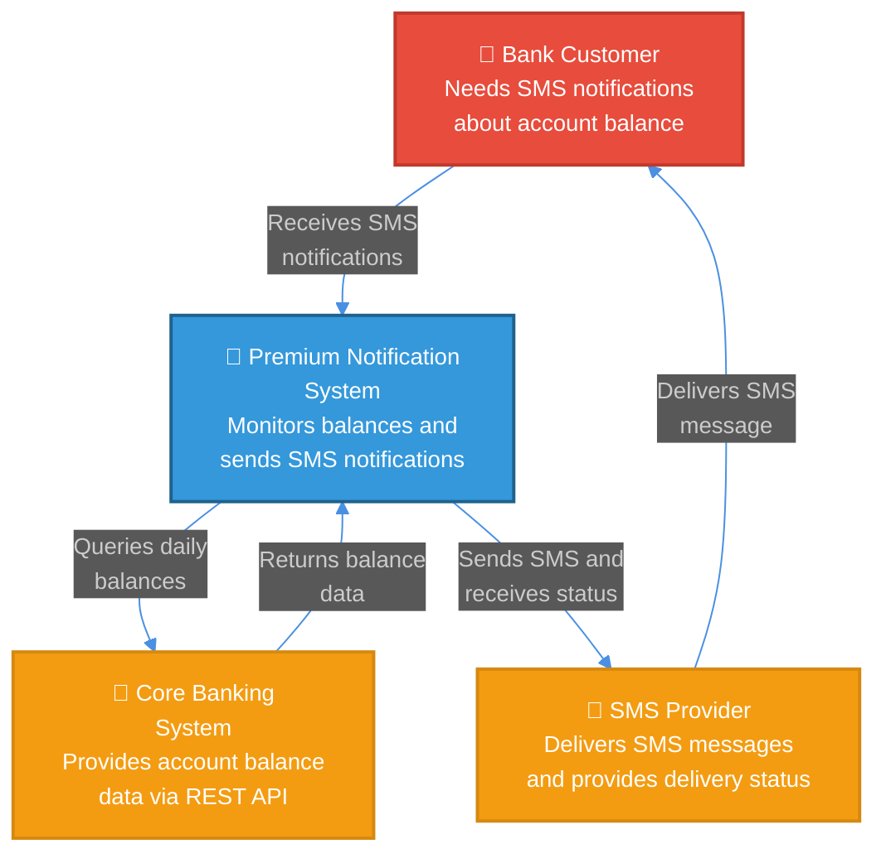

# C4 Context Diagram

```mermaid
%%{init: {'theme':'dark', 'themeVariables': {'primaryColor':'#2E5C8A', 'primaryTextColor':'#fff', 'primaryBorderColor':'#1a3a52', 'lineColor':'#4A90E2', 'secondBkgColor':'#1e1e1e', 'fontSize':'14px', 'fontFamily':'Arial'}, 'flowchart': {'htmlLabels': true}}}%%
graph TB
    Customer["👤 Bank Customer<br/>Needs SMS notifications<br/>about account balance"]
    NotificationSystem["📱 Premium Notification<br/>System<br/>Monitors balances and<br/>sends SMS notifications"]
    BankingSystem["🏦 Core Banking<br/>System<br/>Provides account balance<br/>data via REST API"]
    SMSProvider["📲 SMS Provider<br/>Delivers SMS messages<br/>and provides delivery status"]
    
    Customer -->|Receives SMS<br/>notifications| NotificationSystem
    NotificationSystem -->|Queries daily<br/>balances| BankingSystem
    NotificationSystem -->|Sends SMS and<br/>receives status| SMSProvider
    BankingSystem -->|Returns balance<br/>data| NotificationSystem
    SMSProvider -->|Delivers SMS<br/>message| Customer
    
    style Customer fill:#E74C3C,stroke:#C0392B,stroke-width:2px,color:#fff
    style NotificationSystem fill:#3498DB,stroke:#1f618d,stroke-width:2px,color:#fff
    style BankingSystem fill:#F39C12,stroke:#D68910,stroke-width:2px,color:#fff
    style SMSProvider fill:#F39C12,stroke:#D68910,stroke-width:2px,color:#fff
```
