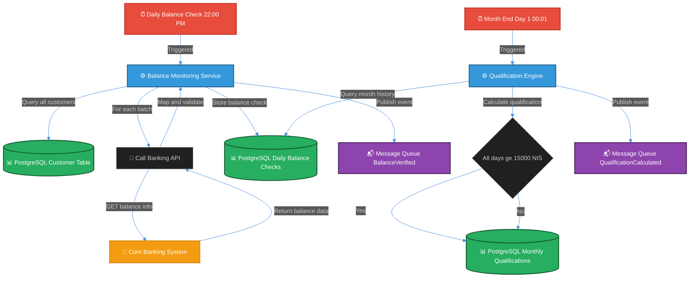
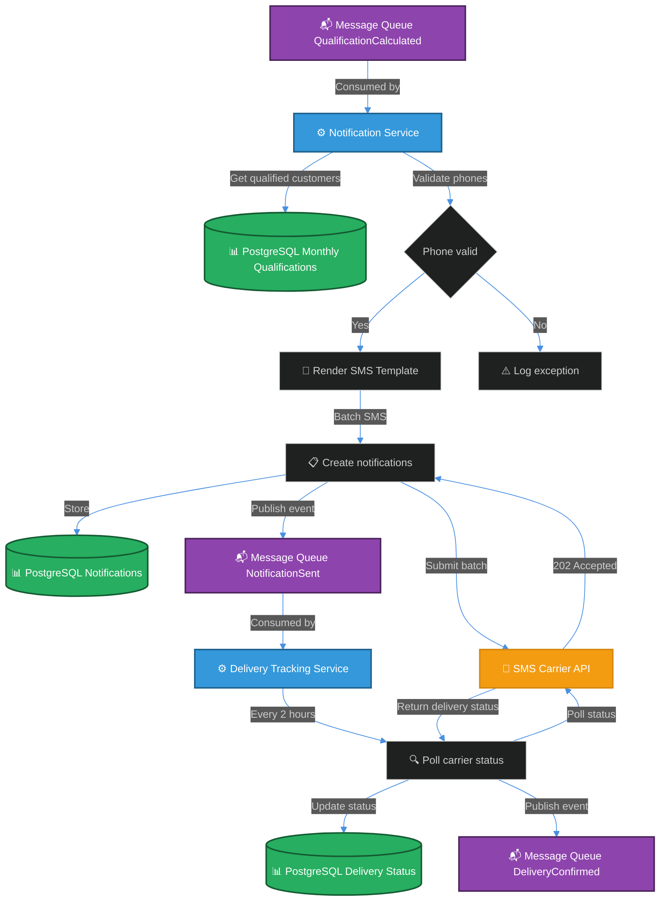
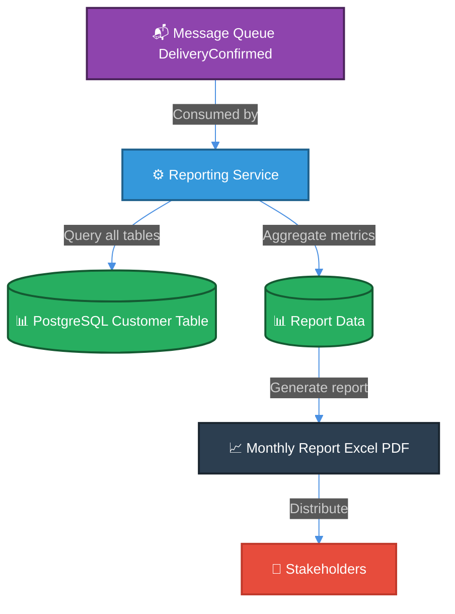

# Data Flow Diagrams

## Balance Verification & Qualification Flow

```mermaid
%%{init: {'theme':'dark', 'themeVariables': {'primaryColor':'#2E5C8A', 'primaryTextColor':'#fff', 'primaryBorderColor':'#1a3a52', 'lineColor':'#4A90E2', 'secondBkgColor':'#1e1e1e', 'fontSize':'14px', 'fontFamily':'Arial'}, 'flowchart': {'htmlLabels': true}}}%%
graph TD
    A["⏰ Daily Balance Check 22:00 PM"]
    B["⚙️ Balance Monitoring Service"]
    C[("📊 PostgreSQL Customer Table")]
    D["🔌 Call Banking API"]
    E["🏦 Core Banking System"]
    F[("📊 PostgreSQL Daily Balance Checks")]
    G["📬 Message Queue BalanceVerified"]
    
    H["⏰ Month End Day 1 00:01"]
    I["⚙️ Qualification Engine"]
    J{All days ge 15000 NIS}
    K[("📊 PostgreSQL Monthly Qualifications")]
    L["📬 Message Queue QualificationCalculated"]
    
    A -->|Triggered| B
    B -->|Query all customers| C
    B -->|For each batch| D
    D -->|GET balance info| E
    E -->|Return balance data| D
    D -->|Map and validate| B
    B -->|Store balance check| F
    B -->|Publish event| G
    
    H -->|Triggered| I
    I -->|Query month history| F
    I -->|Calculate qualification| J
    J -->|Yes| K
    J -->|No| K
    I -->|Publish event| L
    
    style A fill:#E74C3C,stroke:#C0392B,stroke-width:2px,color:#fff
    style H fill:#E74C3C,stroke:#C0392B,stroke-width:2px,color:#fff
    style B fill:#3498DB,stroke:#1f618d,stroke-width:2px,color:#fff
    style I fill:#3498DB,stroke:#1f618d,stroke-width:2px,color:#fff
    style E fill:#F39C12,stroke:#D68910,stroke-width:2px,color:#fff
    style C fill:#27AE60,stroke:#145a32,stroke-width:2px,color:#fff
    style F fill:#27AE60,stroke:#145a32,stroke-width:2px,color:#fff
    style K fill:#27AE60,stroke:#145a32,stroke-width:2px,color:#fff
    style G fill:#8E44AD,stroke:#4a235a,stroke-width:2px,color:#fff
    style L fill:#8E44AD,stroke:#4a235a,stroke-width:2px,color:#fff
```

## SMS Notification Dispatch & Delivery Tracking

```mermaid
%%{init: {'theme':'dark', 'themeVariables': {'primaryColor':'#2E5C8A', 'primaryTextColor':'#fff', 'primaryBorderColor':'#1a3a52', 'lineColor':'#4A90E2', 'secondBkgColor':'#1e1e1e', 'fontSize':'14px', 'fontFamily':'Arial'}, 'flowchart': {'htmlLabels': true}}}%%
graph TD
    L["📬 Message Queue QualificationCalculated"]
    M["⚙️ Notification Service"]
    K[("📊 PostgreSQL Monthly Qualifications")]
    N{Phone valid}
    O["📝 Render SMS Template"]
    P["⚠️ Log exception"]
    Q["📋 Create notifications"]
    R[("📊 PostgreSQL Notifications")]
    S["📲 SMS Carrier API"]
    T["📬 Message Queue NotificationSent"]
    
    U["⚙️ Delivery Tracking Service"]
    V["🔍 Poll carrier status"]
    W[("📊 PostgreSQL Delivery Status")]
    X["📬 Message Queue DeliveryConfirmed"]
    
    L -->|Consumed by| M
    M -->|Get qualified customers| K
    M -->|Validate phones| N
    N -->|Yes| O
    N -->|No| P
    O -->|Batch SMS| Q
    Q -->|Store| R
    Q -->|Submit batch| S
    S -->|202 Accepted| Q
    Q -->|Publish event| T
    
    T -->|Consumed by| U
    U -->|Every 2 hours| V
    V -->|Poll status| S
    S -->|Return delivery status| V
    V -->|Update status| W
    V -->|Publish event| X
    
    style L fill:#8E44AD,stroke:#4a235a,stroke-width:2px,color:#fff
    style T fill:#8E44AD,stroke:#4a235a,stroke-width:2px,color:#fff
    style X fill:#8E44AD,stroke:#4a235a,stroke-width:2px,color:#fff
    style M fill:#3498DB,stroke:#1f618d,stroke-width:2px,color:#fff
    style U fill:#3498DB,stroke:#1f618d,stroke-width:2px,color:#fff
    style S fill:#F39C12,stroke:#D68910,stroke-width:2px,color:#fff
    style K fill:#27AE60,stroke:#145a32,stroke-width:2px,color:#fff
    style R fill:#27AE60,stroke:#145a32,stroke-width:2px,color:#fff
    style W fill:#27AE60,stroke:#145a32,stroke-width:2px,color:#fff
```

## Reporting & Analytics

```mermaid
%%{init: {'theme':'dark', 'themeVariables': {'primaryColor':'#2E5C8A', 'primaryTextColor':'#fff', 'primaryBorderColor':'#1a3a52', 'lineColor':'#4A90E2', 'secondBkgColor':'#1e1e1e', 'fontSize':'14px', 'fontFamily':'Arial'}, 'flowchart': {'htmlLabels': true}}}%%
graph TD
    X["📬 Message Queue DeliveryConfirmed"]
    Y["⚙️ Reporting Service"]
    C[("📊 PostgreSQL Customer Table")]
    Z[("📊 Report Data")]
    AA["📈 Monthly Report Excel PDF"]
    AB["👥 Stakeholders"]
    
    X -->|Consumed by| Y
    Y -->|Query all tables| C
    Y -->|Aggregate metrics| Z
    Z -->|Generate report| AA
    AA -->|Distribute| AB
    
    style X fill:#8E44AD,stroke:#4a235a,stroke-width:2px,color:#fff
    style Y fill:#3498DB,stroke:#1f618d,stroke-width:2px,color:#fff
    style C fill:#27AE60,stroke:#145a32,stroke-width:2px,color:#fff
    style Z fill:#27AE60,stroke:#145a32,stroke-width:2px,color:#fff
    style AA fill:#2C3E50,stroke:#1A252F,stroke-width:2px,color:#fff
    style AB fill:#E74C3C,stroke:#C0392B,stroke-width:2px,color:#fff
```
