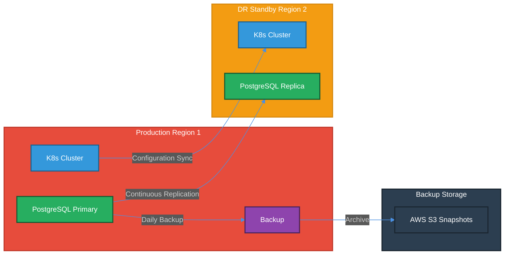

# Deployment Architecture

## Kubernetes Deployment Topology

```mermaid
%%{init: {'theme':'dark', 'themeVariables': {'primaryColor':'#2E5C8A', 'primaryTextColor':'#fff', 'primaryBorderColor':'#1a3a52', 'lineColor':'#4A90E2', 'secondBkgColor':'#1e1e1e', 'fontSize':'14px', 'fontFamily':'Arial'}, 'flowchart': {'htmlLabels': true}}}%%
graph TB
    subgraph Users["👥 Client Layer"]
        Client["End Users"]
    end
    
    subgraph CDN["🌐 Edge Layer"]
        EdgeCache["CDN"]
    end
    
    subgraph Ingress["🚪 Ingress Layer"]
        LB["Load Balancer"]
        Firewall["WAF Firewall"]
    end
    
    subgraph API["🔌 API Layer"]
        Balance["Balance Service"]
        Qualification["Qualification Service"]
        Notification["Notification Service"]
        Tracking["Tracking Service"]
        Reporting["Reporting Service"]
    end
    
    subgraph Cache["⚡ Cache Layer"]
        Redis["Redis Cluster"]
    end
    
    subgraph Queue["📨 Message Layer"]
        RabbitMQ["RabbitMQ Cluster"]
    end
    
    subgraph DB["💾 Database Layer"]
        Primary["PostgreSQL<br/>Primary"]
        Replica["PostgreSQL<br/>Replica"]
    end
    
    subgraph External["🌍 External Systems"]
        Banking["Banking API"]
        SMS["SMS Provider"]
    end
    
    subgraph Monitor["📊 Observability"]
        Prom["Prometheus"]
        Logs["ELK Stack"]
    end
    
    Client -->|HTTPS| EdgeCache
    EdgeCache -->|Route| Firewall
    Firewall -->|Validate| LB
    LB -->|Distribute| Balance
    LB -->|Distribute| Qualification
    LB -->|Distribute| Notification
    LB -->|Distribute| Tracking
    LB -->|Distribute| Reporting
    
    Balance -->|Query| Banking
    Balance -->|Publish| RabbitMQ
    Balance -->|Read| Redis
    Balance -->|Store| Primary
    
    Qualification -->|Consume| RabbitMQ
    Qualification -->|Read| Primary
    Qualification -->|Cache| Redis
    
    Notification -->|Consume| RabbitMQ
    Notification -->|Read| Primary
    Notification -->|Send| SMS
    Notification -->|Cache| Redis
    
    Tracking -->|Consume| RabbitMQ
    Tracking -->|Poll| SMS
    Tracking -->|Update| Primary
    
    Reporting -->|Consume| RabbitMQ
    Reporting -->|Read| Primary
    Reporting -->|Cache| Redis
    
    Primary -->|Replicate| Replica
    
    Balance -->|Metrics| Prom
    Qualification -->|Metrics| Prom
    Notification -->|Metrics| Prom
    Tracking -->|Metrics| Prom
    Reporting -->|Metrics| Prom
    
    Balance -->|Logs| Logs
    Qualification -->|Logs| Logs
    Notification -->|Logs| Logs
    Tracking -->|Logs| Logs
    Reporting -->|Logs| Logs
    
    style Client fill:#E74C3C,stroke:#C0392B,stroke-width:2px,color:#fff
    style EdgeCache fill:#F39C12,stroke:#D68910,stroke-width:2px,color:#fff
    style LB fill:#E74C3C,stroke:#C0392B,stroke-width:2px,color:#fff
    style Firewall fill:#E74C3C,stroke:#C0392B,stroke-width:2px,color:#fff
    style Balance fill:#3498DB,stroke:#1f618d,stroke-width:2px,color:#fff
    style Qualification fill:#3498DB,stroke:#1f618d,stroke-width:2px,color:#fff
    style Notification fill:#3498DB,stroke:#1f618d,stroke-width:2px,color:#fff
    style Tracking fill:#3498DB,stroke:#1f618d,stroke-width:2px,color:#fff
    style Reporting fill:#3498DB,stroke:#1f618d,stroke-width:2px,color:#fff
    style Redis fill:#27AE60,stroke:#145a32,stroke-width:2px,color:#fff
    style RabbitMQ fill:#8E44AD,stroke:#4a235a,stroke-width:2px,color:#fff
    style Primary fill:#27AE60,stroke:#145a32,stroke-width:2px,color:#fff
    style Replica fill:#27AE60,stroke:#145a32,stroke-width:2px,color:#fff
    style Banking fill:#F39C12,stroke:#D68910,stroke-width:2px,color:#fff
    style SMS fill:#F39C12,stroke:#D68910,stroke-width:2px,color:#fff
    style Prom fill:#2C3E50,stroke:#1A252F,stroke-width:2px,color:#fff
    style Logs fill:#2C3E50,stroke:#1A252F,stroke-width:2px,color:#fff
    style Users fill:#2e2e2e,stroke:#555,stroke-width:2px
    style CDN fill:#2e2e2e,stroke:#555,stroke-width:2px
    style Ingress fill:#2e2e2e,stroke:#555,stroke-width:2px
    style API fill:#2e2e2e,stroke:#555,stroke-width:2px
    style Cache fill:#2e2e2e,stroke:#555,stroke-width:2px
    style Queue fill:#2e2e2e,stroke:#555,stroke-width:2px
    style DB fill:#2e2e2e,stroke:#555,stroke-width:2px
    style External fill:#2e2e2e,stroke:#555,stroke-width:2px
    style Monitor fill:#2e2e2e,stroke:#555,stroke-width:2px
```

## Disaster Recovery and High Availability

```mermaid
%%{init: {'theme':'dark', 'themeVariables': {'primaryColor':'#2E5C8A', 'primaryTextColor':'#fff', 'primaryBorderColor':'#1a3a52', 'lineColor':'#4A90E2', 'secondBkgColor':'#1e1e1e', 'fontSize':'14px', 'fontFamily':'Arial'}, 'flowchart': {'htmlLabels': true}}}%%
graph LR
    subgraph Prod["Production Region 1"]
        P_K8s["K8s Cluster"]
        P_DB["PostgreSQL Primary"]
        P_Backup["Backup"]
    end
    
    subgraph DR["DR Standby Region 2"]
        DR_K8s["K8s Cluster"]
        DR_DB["PostgreSQL Replica"]
    end
    
    subgraph Storage["Backup Storage"]
        S3["AWS S3 Snapshots"]
    end
    
    P_DB -->|Continuous Replication| DR_DB
    P_DB -->|Daily Backup| P_Backup
    P_Backup -->|Archive| S3
    
    P_K8s -->|Configuration Sync| DR_K8s
    
    style Prod fill:#E74C3C,stroke:#C0392B,stroke-width:2px,color:#fff
    style DR fill:#F39C12,stroke:#D68910,stroke-width:2px,color:#fff
    style Storage fill:#2C3E50,stroke:#1A252F,stroke-width:2px,color:#fff
    style P_K8s fill:#3498DB,stroke:#1f618d,stroke-width:2px,color:#fff
    style DR_K8s fill:#3498DB,stroke:#1f618d,stroke-width:2px,color:#fff
    style P_DB fill:#27AE60,stroke:#145a32,stroke-width:2px,color:#fff
    style DR_DB fill:#27AE60,stroke:#145a32,stroke-width:2px,color:#fff
    style P_Backup fill:#8E44AD,stroke:#4a235a,stroke-width:2px,color:#fff
    style S3 fill:#2C3E50,stroke:#1A252F,stroke-width:2px,color:#fff
```
